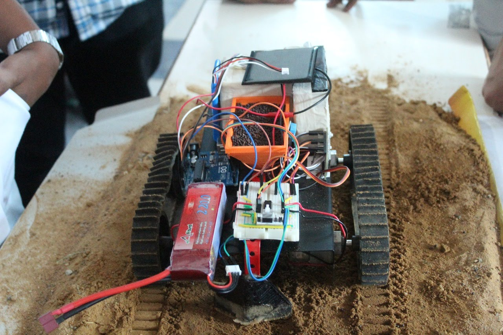

# FARM-E Plantation Robot

**FARM-E** is a multifunctional plantation robot designed to automate key agricultural processes such as **ploughing, sowing, watering**, and **enclosing**. It performs these tasks at regular intervals when placed in a field, while also monitoring and updating real-time environmental data like **temperature** and **humidity**.

---

## 🛠️ Hardware Overview

- **Microcontrollers Used:** Arduino UNO & NodeMCU 1.2  
- **Communication Protocol:** Serial Communication  
- **Mobility:** 200 RPM DC Geared Motors  
- **Custom Parts:** 3D-printed funnel and water tank  
- **Chassis:** Custom-built metal frame

---

## 💡 Features

- Dual operation modes: **Automated** and **Manual**  
- **Mobile app** (built with MIT App Inventor) for remote control and monitoring  
- Real-time **temperature** and **humidity** display on the app  
- Integrates multiple agricultural tasks into one compact unit

---

## 🧠 Programming

The robot is programmed using the **Arduino IDE**.  
The Arduino UNO and NodeMCU 1.2 communicate via **Serial Communication** to coordinate sensor readings and actuation.

---

## 🚀 Advantages

Compared to traditional plantation machinery, FARM-E offers:

- Multiple tasks in one pass (ploughing, sowing, watering, enclosing)  
- App-based control and monitoring  
- Greater efficiency and lower labor requirements  
- Ideal for small to medium-scale farms
